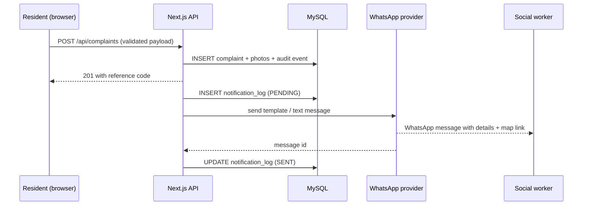

# Pune Civic Portal

A production-ready resident grievance platform for **Pune, India**. Residents register once, file
civic complaints with photos and a map pin, and every complaint is pushed automatically to the
social worker's **WhatsApp** number within seconds.

Built as a single deployable Next.js application (App Router, React Server Components) backed by
MySQL, designed for both desktop and mobile browsers.

---

## Modules

| Module                        | Capability                                                                                                                                                                           |
| ----------------------------- | ------------------------------------------------------------------------------------------------------------------------------------------------------------------------------------ |
| **1 — Resident registration** | Self-service sign-up and profile management: name, profile photo, DOB, gender, mobile, email, address, locality, ward, city, state, PIN code.                                        |
| **2 — Grievance management**  | Complaint title, description, category, priority, area address, landmark, ward, PIN, contact number, up to 5 photos, geolocation map pin, lifecycle tracking with an audit timeline. |
| **3 — WhatsApp messaging**    | Every new complaint is delivered to one configured WhatsApp number with full details and a Google Maps link. Delivery attempts are logged and can be retried.                        |

---

## Technology stack

| Layer         | Choice                                                                                     |
| ------------- | ------------------------------------------------------------------------------------------ |
| Frontend      | Next.js 16 (App Router), React 19, Tailwind CSS 4, Leaflet + OpenStreetMap                 |
| Backend       | Next.js Route Handlers (Node runtime), Zod validation, Prisma ORM                          |
| Database      | MySQL 8                                                                                    |
| Messaging     | Meta WhatsApp Cloud API (primary), Twilio WhatsApp (alternative), console stub (local dev) |
| Auth          | HTTP-only JWT session cookie (`jose`), bcrypt password hashing                             |
| Observability | Pino structured logging, `/api/health` readiness probe                                     |
| Delivery      | Multi-stage Dockerfile (standalone output), Docker Compose                                 |

---

## Quick start (local)

```bash
# 1. Install dependencies
npm install

# 2. Configure environment
cp .env.example .env      # then edit values

# 3. Start MySQL (or point DATABASE_URL at an existing server)
docker compose up -d mysql

# 4. Apply the schema and create the bootstrap admin
npm run prisma:deploy
npm run seed

# 5. Run
npm run dev               # http://localhost:3000
```

Sign in with `SEED_ADMIN_EMAIL` / `SEED_ADMIN_PASSWORD` to reach the staff console at `/admin`.
Residents register themselves at `/register`.

> **Corporate TLS note:** if Prisma cannot download its engines behind a TLS-inspecting proxy,
> export your root CA bundle and set `NODE_EXTRA_CA_CERTS=/path/to/ca.pem`.

---

## Environment variables

All variables are validated at boot by `src/lib/env.ts` — the app refuses to start with an
incomplete or unsafe configuration. See [.env.example](.env.example) for the full annotated list.

Key entries:

| Variable                 | Purpose                                                              |
| ------------------------ | -------------------------------------------------------------------- |
| `DATABASE_URL`           | MySQL connection string.                                             |
| `AUTH_SECRET`            | ≥32-char secret for session JWT signing (`openssl rand -base64 48`). |
| `SOCIAL_WORKER_WHATSAPP` | **The destination number**, E.164 digits only, e.g. `919812345678`.  |
| `WHATSAPP_PROVIDER`      | `meta`, `twilio` or `console`. `console` is rejected in production.  |
| `STORAGE_LOCAL_DIR`      | Directory for uploaded images (mount a volume in production).        |

---

## WhatsApp setup

### Option A — Meta WhatsApp Cloud API (recommended)

1. Create a Meta app, add the **WhatsApp** product, and note the **Phone Number ID**.
2. Generate a permanent **System User access token** with `whatsapp_business_messaging`.
3. Submit a message template named `civic_complaint_alert` (category: _Utility_) with **7 body
   variables**, for example:

   ```
   New civic complaint {{1}}.
   Category: {{2}}
   Title: {{3}}
   Details: {{4}}
   Location: {{5}}
   Reported by: {{6}}
   Map / portal link: {{7}}
   ```

   The parameter order is produced by `buildTemplateParams()` in
   [src/lib/whatsapp/message.ts](src/lib/whatsapp/message.ts).

4. Set `WHATSAPP_PROVIDER=meta`, `META_WHATSAPP_TOKEN`, `META_WHATSAPP_PHONE_NUMBER_ID`,
   `META_WHATSAPP_TEMPLATE_NAME` and `META_WHATSAPP_TEMPLATE_LANG`.
5. _(Optional)_ Register the delivery-receipt webhook at
   `https://<your-domain>/api/whatsapp/webhook` and set `META_WHATSAPP_VERIFY_TOKEN` and
   `META_WHATSAPP_APP_SECRET`. Inbound requests are rejected unless the
   `X-Hub-Signature-256` HMAC matches.

Business-initiated messages outside WhatsApp's 24-hour service window **must** use an approved
template; the provider automatically falls back to a free-form text message when the recipient has
messaged recently.

### Option B — Twilio

Set `WHATSAPP_PROVIDER=twilio`, `TWILIO_ACCOUNT_SID`, `TWILIO_AUTH_TOKEN` and
`TWILIO_WHATSAPP_FROM` (e.g. `whatsapp:+14155238886`).

### Option C — Console (local development only)

`WHATSAPP_PROVIDER=console` prints the formatted message to the server log so the full flow can be
exercised without provider credentials.

---

## Architecture

```
src/
├─ app/
│  ├─ (auth)/            login + registration pages
│  ├─ dashboard/         resident area: complaint list, new complaint, detail, profile
│  ├─ admin/             staff grievance console + complaint workspace
│  └─ api/               route handlers (auth, residents, complaints, admin, uploads, files,
│                        health, whatsapp webhook)
├─ components/           reusable client/server UI (forms, map picker, uploader, nav)
├─ lib/
│  ├─ env.ts             fail-fast environment validation
│  ├─ db.ts              Prisma singleton
│  ├─ session.ts         edge-safe JWT helpers (used by proxy.ts)
│  ├─ auth.ts            password hashing, session cookies, lockout policy
│  ├─ api.ts             response envelope, error mapping, CSRF + rate limiting
│  ├─ validation.ts      Zod schemas and domain constants (categories, Pune wards)
│  ├─ storage.ts         image validation, EXIF stripping, traversal-safe paths
│  └─ whatsapp/          provider abstraction, message builders, delivery ledger
└─ proxy.ts              route protection (Next.js 16 proxy convention)
```

### Complaint submission flow



The dispatch is deliberately decoupled from the HTTP response: a messaging outage never blocks a
citizen from filing a complaint. Failed alerts stay visible in the admin console with a
**Resend WhatsApp alert** action, and retries use exponential backoff.

---

## Security controls

- **Authentication** — bcrypt (cost 12), HTTP-only + `SameSite=Lax` + `Secure` session cookie,
  signed HS256 JWT with issuer/audience checks.
- **Brute force** — 5 failed attempts locks an account for 15 minutes; login responses are
  constant-shape to avoid user enumeration.
- **Authorisation** — route-level protection in `proxy.ts` plus object-level ownership checks in
  every handler; residents can never read another resident's complaint.
- **Input validation** — every request body and query string parsed with Zod before use.
- **CSRF** — `Origin` header verification on all state-changing requests.
- **Rate limiting** — per-IP fixed window on registration, login, uploads, complaint creation and
  retries (swap the store in `src/lib/rate-limit.ts` for Redis in multi-replica deployments).
- **File uploads** — magic-byte content sniffing, size caps, re-encoding to WebP (strips EXIF/GPS
  and embedded payloads), traversal-safe path resolution, `nosniff` on delivery.
- **Injection** — Prisma parameterised queries throughout; no raw SQL on user input.
- **Transport / headers** — HSTS, CSP, `X-Frame-Options: DENY`, `X-Content-Type-Options`,
  Referrer-Policy and Permissions-Policy applied globally.
- **Secrets** — never logged (Pino redaction); `.env` is git-ignored.
- **Dependencies** — `npm audit` reports zero known vulnerabilities.

---

## Available scripts

| Script                   | Description                        |
| ------------------------ | ---------------------------------- |
| `npm run dev`            | Development server                 |
| `npm run build`          | Prisma generate + production build |
| `npm start`              | Start the production server        |
| `npm run lint`           | ESLint                             |
| `npm run typecheck`      | TypeScript, no emit                |
| `npm run prisma:migrate` | Create/apply a dev migration       |
| `npm run prisma:deploy`  | Apply migrations (production)      |
| `npm run prisma:studio`  | Browse the database                |
| `npm run seed`           | Create the bootstrap admin account |

---

## Deployment

### Docker Compose

```bash
cp .env.example .env      # set real secrets, WHATSAPP_PROVIDER=meta, APP_URL=https://...
docker compose up -d --build
docker compose exec app npx prisma migrate deploy
docker compose exec app npm run seed
```

The image uses Next.js `standalone` output, runs as a non-root user and exposes a `HEALTHCHECK`
against `/api/health`. Uploaded images live on the `uploads` volume — back it up, or switch
`STORAGE_DRIVER` to `s3` and implement the S3 branch in `src/lib/storage.ts` for object storage.

### Production checklist

- [ ] `AUTH_SECRET` generated per environment and stored in a secret manager
- [ ] `APP_URL` set to the public HTTPS origin (used by CSRF checks and WhatsApp links)
- [ ] `WHATSAPP_PROVIDER` is `meta` or `twilio`, template approved
- [ ] TLS terminated at the load balancer; `/api/health` wired to liveness + readiness probes
- [ ] Persistent volume (or S3 bucket) mounted for uploads
- [ ] MySQL automated backups and point-in-time recovery enabled
- [ ] Rate limiter backed by Redis if running more than one replica
- [ ] Log shipping configured (Pino emits JSON on stdout)

---

## API reference

| Method         | Endpoint                              | Auth    | Purpose                                |
| -------------- | ------------------------------------- | ------- | -------------------------------------- |
| `POST`         | `/api/auth/register`                  | Public  | Resident registration                  |
| `POST`         | `/api/auth/login`                     | Public  | Sign in                                |
| `POST`         | `/api/auth/logout`                    | Session | Sign out                               |
| `GET`          | `/api/auth/me`                        | Session | Current user                           |
| `GET` / `PUT`  | `/api/residents/me`                   | Session | Read / update profile                  |
| `GET` / `POST` | `/api/complaints`                     | Session | List own complaints / file a complaint |
| `GET`          | `/api/complaints/{id}`                | Session | Complaint detail (ownership enforced)  |
| `POST`         | `/api/uploads`                        | Mixed   | Image upload                           |
| `GET`          | `/api/files/{...path}`                | Public  | Serve stored image                     |
| `GET`          | `/api/admin/complaints`               | Staff   | All complaints + stats                 |
| `PATCH`        | `/api/admin/complaints/{id}`          | Staff   | Status / priority transition           |
| `POST`         | `/api/admin/notifications/{id}/retry` | Staff   | Re-send a failed WhatsApp alert        |
| `GET`          | `/api/health`                         | Public  | Liveness / readiness                   |
| `GET` / `POST` | `/api/whatsapp/webhook`               | Signed  | Meta verification + delivery receipts  |

All responses use a consistent envelope: `{ "data": ... }` on success,
`{ "error": { "code", "message", "details" } }` on failure.
